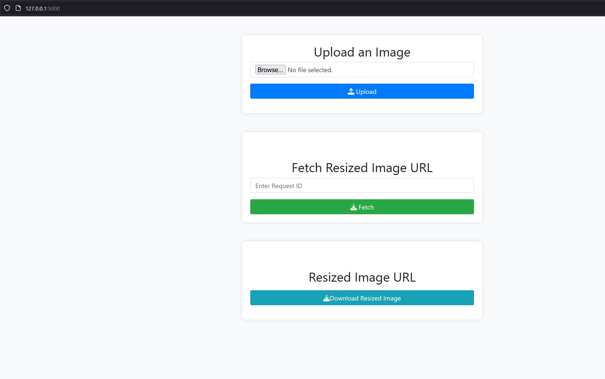

# Image Resizer
Image resizer using AWS S3, lambda and Flask

# Setup
- clone this repository in local
- in a command prompt / shell, run setup.sh (linux) or setup_windows.bat (windows)

# Start up
- in a command prompt / shell, run start_app.sh (linux) or start_app_windows.bat (windows)

The app will start on local host at port 5000

Goto http://127.0.0.1:5000/

Click the Browse button to select an image file. Click on Upload button once the file is selected.

Only filenames ending with .jpg, .jpeg and .png are permitted

Clicking of upload with run the Flask code to upload the file into s3 bucket folder and it will return a unique UUID in the form of request id which will be associated with the uploaded image.

The request id will get auto-populated to the fetch url text box.

After 2 to 3 seconds, when you click the Fetch button, it will attempt to fetch the pre-signed URL of the resized image.

If the pre-signed URL was successfully created, it will be displayed on the screen for copying purposes.
And you can download the resized image using the Download button

At the AWS layer, the S3 bucket PUT operation will trigger a lambda function that resizes the image and puts the resized version into a separate bucket.
The lambda python code responsible for the business logic can be found at [lambda_code/lambda_function.py](lambda_code/lambda_function.py)
